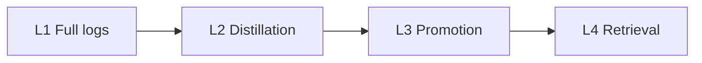

# KRouter Obsidian

Author-vault results (2026-08-21): retrieval blind test **25/25**, canonical routing 26/26 topics · 156/156 aliases, **72** consecutive sealed days, **30** real tasks, execution gate passed, host daily evolution running.

Obsidian knowledge routing for agents. One short noun hits the page that should change this action, and returns a SHA-256 receipt. Corrections are written to canonical pages and retrieved on the next similar task. The vault gets sharper; the agent gets steadier. No vector index.

This repository is an installable protocol. Details: [`docs/ARCHITECTURE.md`](docs/ARCHITECTURE.md). Invariants: [`PROTOCOL.md`](PROTOCOL.md). MIT.

GitHub repo: `runtime36`. Product: **KRouter Obsidian**. Vault folder names stay in Chinese (`01 项目` …); that is the on-disk layout, not the docs language. Chinese overview: [`README.zh.md`](README.zh.md).

## Four layers

Write-up maturity, then retrieval. The five folders are storage. They do not replace these layers.



| Layer | Rule |
|---|---|
| L1 Full logs | `05` — one note per day. Episodic memory, not a result |
| L2 Distillation | Daily evolution and reviews. Summaries never replace originals |
| L3 Promotion | Five gates into `provisional`; host adopts and the task is accepted → `active` |
| L4 Retrieval | One short noun hits one page. Receipt includes SHA-256. No vector store |

Full ladder, trust rules, receipts, and write-back: [`docs/ARCHITECTURE.md`](docs/ARCHITECTURE.md).

## Invariants

- The host sets `OBSIDIAN_VAULT`. This repo hard-codes nobody’s home directory.
- Queries are one contiguous noun. Do not send a full question as if spaces were AND.
- If the receipt has `canonical_match: true`, the agent **must** cite `canonical_source`. Nearby notes are not substitutes.
- Clippings originals are copied only. Do not move, edit, or delete them.
- `status` reads `Agent第二大脑.md`.
- Daily evolution and the execution hook live under `extras/` and are off by default.

Alias scoring: exact match, then alias-in-query, then query-in-alias (length ≥ 2). Tied scores resolve to the lowest id only when they point at the same file; otherwise there is no hit.

## Install

Requires `python3` and `rg`.

```bash
git clone https://github.com/398894496-arch/runtime36.git
cd runtime36
chmod +x scripts/*.sh skill/krouter-obsidian/scripts/*.sh
./scripts/first_run.sh
```

`first_run.sh` validates the bundled `template/` only. It does not inherit a host `OBSIDIAN_VAULT`. Set `KROUTER_FIRST_RUN_VAULT` to aim it elsewhere.

Pass criterion: `search home` yields `canonical_id: Q01`, `source` at `template/Agent第二大脑.md`, plus `source_sha256` and `canonical_map_sha256`.

```bash
cp -R template /path/to/YourVault
export OBSIDIAN_VAULT=/path/to/YourVault
./scripts/install.sh
```

Installs to `~/.agents/skills/krouter-obsidian` and `~/.cursor/rules/krouter-obsidian.mdc`. Pass `--force` to replace an existing skill. This path does not overwrite `obsidian-knowledge-router`. Then rewrite `canonical_sources.psv` with the host’s own nouns.

## Layout

| Path | Role |
|---|---|
| `docs/ARCHITECTURE.md` | Four-layer architecture and promotion |
| `template/` | Empty five zones; home `Agent第二大脑.md`; provisional index |
| `skill/krouter-obsidian/` | `route_knowledge.sh`, `canonical_lookup.py`, alias table |
| `scripts/install.sh` | Install into the agent runtime |
| `scripts/first_run.sh` | Mechanical check |
| `scripts/validate_vault.py` | YAML, Clippings ledger, log continuity |
| `extras/cursor/` | Cursor always-on rule |
| `extras/codex/` | Codex handbook snippet |
| `extras/hooks/` | Optional: block Clippings mutation and Obsidian restart |
| `extras/host-daily-evolution/` | Optional host daily evolution |

## Proven in the author’s vault

As of 2026-08-21: retrieval blind test 25/25; canonical routing 26/26 topics, 156/156 aliases; 72 consecutive sealed days; 30 real tasks; execution gate passed; host daily evolution running.

Retrieval hits the canonical page with a SHA receipt. Corrections are written in and retrieved next time.
