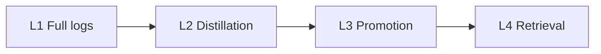

# KRouter Obsidian — DSH Plugin: Agent Second Brain

[](https://github.com/398894496-arch/runtime36/actions/workflows/ci.yml)

**DeepSeek Harness plugin.** A deterministic **memory system** and **knowledge base** for AI agents that already live in [Obsidian](https://obsidian.md). Optional **self-evolution**. Also mounts on Cursor and Codex. The vault home page is `Agent第二大脑.md`.

Not a notes app. Not a generic memory SDK. Not an MCP vector store. One short noun hits the page that should change this action. You get a SHA-256 receipt. Wrong-neighbor cites are a protocol violation, not a retrieval quirk.

```bash
dsh plugin add github:398894496-arch/runtime36
```

Read-only tools: `krouter_status`, `krouter_search`, `krouter_suggest`. **`dsh plugin add` does not create a daily job.** Self-evolution is [`extras/host-daily-evolution/`](extras/host-daily-evolution/).

**Try the template in fifteen minutes** (no DSH required). No GPU. No Docker. No embedding daemon. The author runs the live vault on an **8 GB M2 Mac** with `python3` + `rg` only.

```bash
git clone https://github.com/398894496-arch/runtime36.git
cd runtime36
python3 -m pip install -r requirements.txt   # PyYAML, for validate_vault.py
./scripts/first_run.sh
```

Pass: `search home` returns `canonical_id: Q01`, a path to `template/Agent第二大脑.md`, plus `source_sha256` and `canonical_map_sha256`. CI runs that check, the unit tests, and the DSH bridge on every push. You do not have to trust a README score to see the router work.

A miss is not a dead end. `./scripts/krouter suggest homz` prints nearest aliases. Those lines are **hints**, not hits. Add the noun to `canonical_sources.psv` or retry the suggested alias. There is still no vector fallback.

Then copy `template/` to your vault, `export OBSIDIAN_VAULT`, run `./scripts/install.sh`, and rewrite `canonical_sources.psv` with **your** nouns. The template ships eight sample topics. Coverage is the alias table you maintain, not a model.

## Why this exists

Semantic search is good at “close enough.” Agents then cite a nearby preferences note, an old log, or a candidate that was never accepted. KRouter makes that failure mode illegal:

- Alias table first (`canonical_lookup.py`). Ties that point at different files are a miss.
- Literal `rg` only after a miss. No vector fallback.
- Dual SHA receipt. If `canonical_match` is true, the agent **must** open `canonical_source`.
- Logs are clues. Action cites an `active` method, a current correction, or the receipt page.
- Same-day work becomes `provisional`. The next similar task asks to adopt. Accepted task → `active`.

Adding embeddings, a graph, or auto-injection requires proof it beats Markdown + this router + `rg`, and explicit host authorization.

## Cost to run and keep

| | KRouter | Typical agent memory stack |
|---|---|---|
| Always-on services | None | Vector DB, embedder, often a graph or API |
| Machine | Author: 8 GB M2, no GPU | Often a server or a paid memory host |
| What you maintain | Markdown + one alias table | Indexes, sync, prompt injection, expiry jobs |
| After a correction | Edit the canonical page. Next call hits it | Re-embed, hope the old chunk decays |

Maintenance is low because there is nothing to reindex. It is not zero: you still write aliases and promote methods. That work is the product.

## Who should clone this

You use Obsidian **and** Cursor / Codex / Claude Code / DeepSeek Harness (or another local agent). You care that the agent cites the *right* page, not a similar one.

Skip this if you want a cloud memory API, hybrid semantic search, or a filled knowledge base. This repo is the protocol and an empty vault. The author’s notes stay private.

## Install

Requires `python3`, `rg` (ripgrep), and PyYAML (`requirements.txt`). Tests: `python3 -m pip install -r requirements-dev.txt && python3 -m pytest -q`.

```bash
export OBSIDIAN_VAULT=/path/to/YourVault
./scripts/install.sh
```

Installs to `~/.agents/skills/krouter-obsidian` and `~/.cursor/rules/krouter-obsidian.mdc`. Pass `--force` to replace. This path does not overwrite `obsidian-knowledge-router`.

## DeepSeek Harness

Same vault. Third mount. Uninstalling the plugin does not delete notes. Local checkout: `dsh plugin add /path/to/runtime36/extras/dsh`. Set `OBSIDIAN_VAULT` (or `vaultPath`). Details: [`extras/dsh/README.md`](extras/dsh/README.md).

```bash
node extras/dsh/test-bridge.mjs
```

## Optional self-evolution

Daily seal / distillation is an extra: [`extras/host-daily-evolution/`](extras/host-daily-evolution/). Pin a local agent CLI and an OS scheduler. If you skip it, set `template/90 系统文件/自动化/日更健康.md` to `unused`.

## Four layers

Write-up maturity, then retrieval. Five Chinese folder names (`01 项目` …) are the on-disk layout, not the docs language.



| Layer | Rule |
|---|---|
| L1 Full logs | `05` — one note per day. Episodic, not a result |
| L2 Distillation | Daily evolution and reviews. Summaries never replace originals |
| L3 Promotion | Five gates into `provisional`; adopt + accepted task → `active` |
| L4 Retrieval | Short noun, SHA receipt. No vector store |

Full protocol: [`docs/ARCHITECTURE.md`](docs/ARCHITECTURE.md). Invariants: [`PROTOCOL.md`](PROTOCOL.md). MIT. Chinese: [`README.zh.md`](README.zh.md). Changelog: [`CHANGELOG.md`](CHANGELOG.md).

## Public checks

| Path | Role |
|---|---|
| `scripts/krouter` | CLI: `status`, `search`, `suggest`, … |
| `tests/` | Lookup, tie-break, suggestion unit tests |
| `.github/workflows/ci.yml` | pytest + first run + DSH bridge on every push |
| `CHANGELOG.md` | What shipped |

## Author vault (not a clone score)

The protocol was used in the author’s own vault. Measured 2026-08-21: retrieval blind test 25/25 (answer and specified source); 26/26 topics, 156/156 aliases; 72 consecutive sealed days (2026-06-10 → 2026-08-20); 30 real tasks; execution gate passed; host daily evolution running.

Those numbers describe that vault after aliases and promotions existed. `./scripts/first_run.sh` is what this repository can prove on your machine today.
