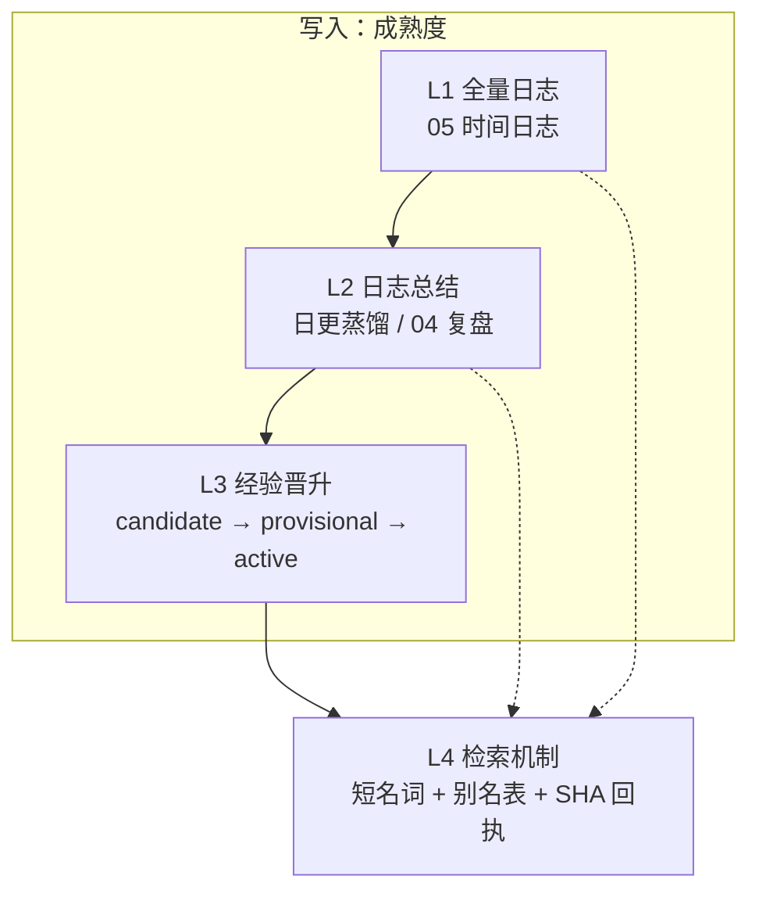

# KRouter Obsidian 架构

本页是协议详情。README 是入口；[`PROTOCOL.md`](../PROTOCOL.md) 是不变量清单。作者私有笔记不在本仓。

作者活库实测（首页 `verified_at: 2026-08-21`）：检索盲测 **25/25**，权威路由 **26/26** 主题、**156/156** 别名，连续封账 **72** 天（2026-06-10 → 2026-08-20），**30** 条真实任务，执行门禁已通过，本机日更持续运行。细节见文末「协议已经跑过」。

KRouter 把知识分成 **写入成熟度四层** 和 **空间五区**。四层回答「这件事现在可信到哪一步」；五区回答「它物理上放哪」。Agent 读库必须走第四层检索，不得从聊天记忆或向量库另开一条真相。



虚线表示检索可以落到任一层，但 **行动只能引用第三层正式方法、当前纠错，或回执指定的那一页**。第一层和第二层默认是线索，不是行动依据。

## 空间五区

与四层同时存在，职责互不替代。

| 区 | 职责 | 对应成熟度 |
|---|---|---|
| `01 项目` | 正在做的事、未完成范围、项目证据入口 | 过程。不晋升为方法 |
| `02 经验与方法` | 下一次应该怎么做 | L3。含 `准经验/` |
| `03 资料与证据` | 输入、原文、结果证据 | 原始层。总结不得替代原文 |
| `04 已完成与复盘` | 已结束的结果与评价 | L2 的一种落点 |
| `05 时间日志` | 某天发生了什么 | L1 |
| `90 系统文件` | 协议、索引、纠错账、验证、自动化健康 | 治理。不是第五业务区 |

首页只有 `Agent第二大脑.md`。不再平行建「总览」「工作台」「第二入口」。

---

## L1 全量日志

位置：`05 时间日志/YYYY-MM/DD｜一句话简述.md`。

规定：

1. **一天一篇，封账连续。** 缺日必须留下「待总结」或同等缺口标记，不得用空文件冒充封账。
2. **事件记忆 ≠ 结果记忆。** 日志证明「做过、问过、失败过」，不自动等于项目已验收。
3. **不保存完整聊天、隐藏推理、凭据。** 需要追溯时写 `source_ref` 指向索引或证据页。
4. **文件名必须让人看懂用途。** `DD｜一句话简述`，禁止用抽象知识管理词代替当天实际工作。
5. **日志可由宿主指定的 Agent 验收**（例如标 `agent-accepted`）。此条 **不覆盖** `02` 正式方法。

原始证据（`03`、Clippings 原件）与 L1 并列：原文不可被日志或总结替代。Clippings 只复制到正式位置，原件不移动、不修改、不删除。

---

## L2 日志总结

从 L1 抽出「可回流项目、可当线索的浓缩」，不是第二份原文。

落点包括：

- 日更蒸馏（项目回流、当天经验候选、月总结入口）
- `04 已完成与复盘`
- 派生笔记的 `source_ref`、`verified_at`、适用范围

规定：

1. **派生必须保留来源、时间、范围、可信度、适用限制。**
2. **日更写手必须是钉死的本机 CLI 二进制**，禁止 PATH 上的同名 `agent`。调度用操作系统定时任务；库内对话插件不当无人值守写入器。失败则留待总结，不换壳重写。
3. **日更默认是 extra**（`extras/host-daily-evolution/`）。未安装不等于协议不存在。
4. 总结可以提出经验候选，**不得直接写入正式 `02`。**

---

## L3 经验晋升

`02` 只回答「下一次应该怎么做」。方法必须来自真实项目结果，并写清适用条件与限制。项目过程留在 `01`。

### 状态

| status | 含义 | Agent 怎么用 |
|---|---|---|
| `candidate` | 仍在项目或资料里 | 不得冒充经验或成果 |
| `provisional` | 准经验 / 准纠错 | 可用稿。下次同类任务必须先问是否采纳 |
| `active` | 正式方法或正式纠错 | 可以作为行动依据，仍须检查是否过期 |
| `rejected` / `superseded` | 否决或被取代 | 不得继续当现行规矩 |

机器内容命中真实任务、来源明确、有可核验结果、与现有知识去重并写清边界后：**当天先入准经验，不长期停在无入口 candidate，也不直接当正式方法。**

### 当天进入准经验的五条

同时满足才写成 `status: provisional`：

1. 来自真实项目或问题。
2. 有结果、证据或当次纠偏。
3. 与已有方法去重。
4. 写清适用条件和限制。
5. 能降低下一次工作的判断或执行成本。

缺任何一条：留在 `01` / `03` 当候选，或标缺口，禁止升格。

### 升正式

```text
准经验  --下次同类任务-->  先问是否采纳
                         ├ 宿主采纳 且 本次任务验收通过 → active（正式 02 / 纠错账）
                         └ 否决或未验收 → 仍为 provisional，或 rejected
```

纠偏同理：准纠错 → 问 → 采纳且验收 → 纠错账 `active`。当前用户指令与最新 `supersedes` 优先于旧日志。

库内对话插件不主写架构、不拦晋升。谁做完谁写；同一文件同一时刻只有一个主写者。

### 可选：方法 → Skill

正式方法在 **同类任务重复验证至少 3 次** 之后，才允许提 Skill 候选。Skill 候选仍不是 `02` 正式方法。未验证次数不得用文件数、会话数、导出版本冒充。

---

## L4 检索机制

Agent 不把整句问题丢进库。丢一个连续短名词。不引入向量库，不派生检索子进程。

### 通道

| 命令 | 用途 |
|---|---|
| `status` | 首页 frontmatter。一次完整结果不必再查 |
| `preference` | 宿主偏好与工作约束 |
| `correction` | 纠错与 `supersedes` |
| `memory` | 高可信记忆索引 |
| `project` | `01 项目` 范围内字面检索 |
| `search` | 先别名命中；否则全库字面检索 |

`OBSIDIAN_VAULT` 由宿主设置。

### 别名打分

`canonical_lookup.py` 对 `canonical_sources.psv`：

1. 别名与查询规范化后完全相等：最高。
2. 别名是查询的子串：次之。
3. 查询是别名的子串且长度 ≥ 2：再次。
4. 去掉「的了着过地得」与标点后再比。
5. 同分只在指向同一文件时取最小 id；否则未命中。
6. 整句未命中时，按空白切开的 token 分值求和，再走同一套决胜。

命中：回执 `canonical_match: true`。Agent **必须**打开并引用 `canonical_source`。不得改引偏好页或其他近邻笔记。映射页若是 `candidate` 或 `rejected`，仍然读它，不跳过。

未命中：在该 route 的范围内 `rg` 字面搜索。跳过 `Clippings/`、备份、冷镜像。

### 回执

每次调用输出 `knowledge-route-v2`：时间、请求路由、命中状态、来源路径、来源 SHA-256、映射 SHA-256。没有回执的「我记得库里有」不算检索。

### 可信度（读取时）

可靠性高不等于把所有内容标成高可信，而是让 Agent 永远知道四件事：什么可行动、什么只是线索、什么必须重核、什么已被否定。

| 等级 | 条件 | 用法 |
|---|---|---|
| 高可信 | 状态有效；来源明确；用户确认或直接文件证据；范围和时间清楚 | 可作行动依据，仍须检查过期 |
| 中可信 | 历史回填、部分证据、尚未最终验收 | 只作检索线索 |
| 候选 / 低可信 | 无来源、新闻、Clippings、机器候选、推断 | 不得当作事实或结果 |

五类记忆：`constraint` 偏好与纠错；`result` 项目结果；`method` 已验证做法；`evidence` 原文与证据；`episodic` 日志。冲突时优先级：当前用户指令 → 纠错账 → 当前真实文件 → 项目证据 → 方法 → 历史日志 → 原始资料与机器内容。

---

## 写回边界

| 写入 | 位置 |
|---|---|
| 项目行动、状态、未完成 | `01 项目/` |
| 已验证方法 | `02 经验与方法/`（先准后正式） |
| 原始来源与证据 | `03 资料与证据/` |
| 结束的结果与复盘 | `04 已完成与复盘/` |
| 每日事件 | `05 时间日志/` |
| 协议、索引、验证、健康 | `90 系统文件/` |

新语义检索、向量层、图数据库或自动注入，必须先证明优于「Markdown + 本路由 + `rg`」，并经宿主明确授权。默认不恢复已退役的向量记忆或图热路径。

---

## 协议已经跑过

作者活库首页 `verified_at: 2026-08-21`。

| 实测 | 结果 |
|---|---|
| 检索盲测 | 25/25：答案正确，且命中指定权威来源 |
| 权威路由 | 26/26 主题、156/156 别名，映射全部在位 |
| 连续封账 | 72 天（2026-06-10 → 2026-08-20） |
| 真实任务 | 30 条，覆盖封账期间的实际工作 |
| 执行门禁 | 已通过。动作前召回生效；剪藏原件改删挪与重启 Obsidian 硬拦已核 |
| 本机日更 | 持续运行。写手为钉死的本机 CLI |

**检索**：短名词命中唯一页，回执带双 SHA。Agent 必须引用 `canonical_source`。经验会被找回。

**纠错与进化**：纠错写入权威页（`supersedes` / 准纠错 → 正式纠错）。下次同类任务走 L4 命中新页，旧说法不再作为现行规矩。准经验经采纳与验收后成为 `active`。库越用越准，Agent 越用越稳。

日更与执行钩子在开源仓以 extra 提供；作者库已按协议运行。

English overview: [`README.en.md`](../README.en.md).
