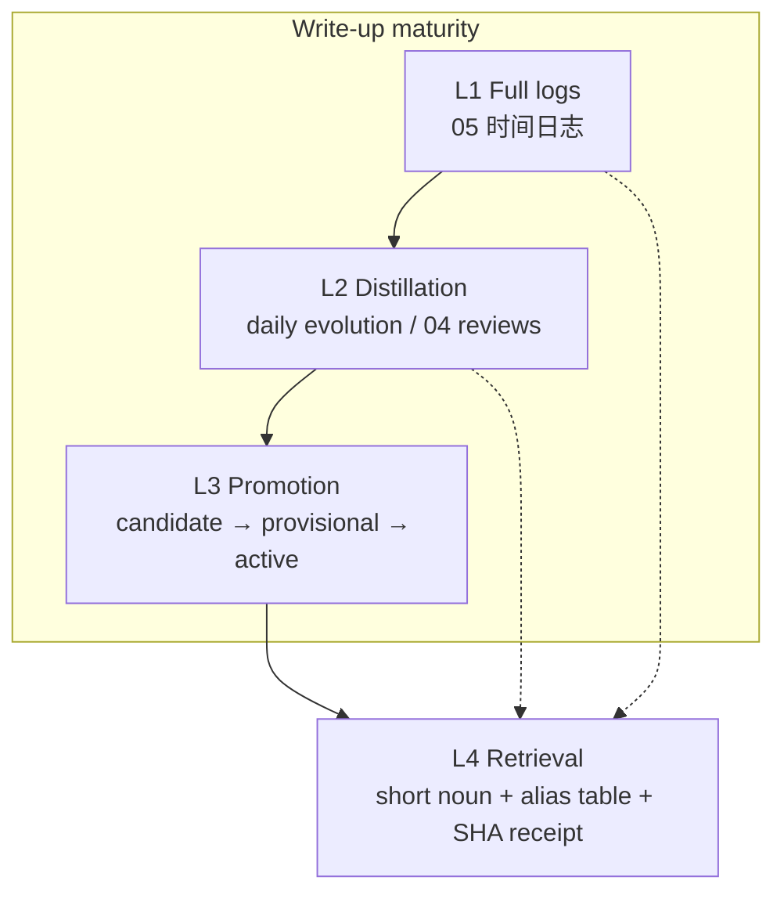

# KRouter Obsidian architecture

This is the protocol detail. README is the entry; [`PROTOCOL.md`](../PROTOCOL.md) is the invariant list. The author’s private notes are not in this repository.

Author-vault results (home `verified_at: 2026-08-21`): retrieval blind test **25/25**, canonical routing **26/26** topics and **156/156** aliases, **72** consecutive sealed days (2026-06-10 → 2026-08-20), **30** real tasks, execution gate passed, host daily evolution running. See **Proven in the author’s vault** at the end.

KRouter splits knowledge into **four write-up maturity layers** and **five spatial zones**. Layers answer how far this claim can be trusted. Zones answer where the file lives. Agents must read the vault through layer 4. Chat memory and vector indexes are not a second source of truth.

Vault folder names stay in Chinese. That is the on-disk layout.



Dashed lines: retrieval may land on any layer. **Action may cite only a formal method, a current correction, or the receipt’s `canonical_source`.** Layers 1 and 2 are clues by default, not action basis.

## Five spatial zones

These exist alongside the four layers. They do not replace them.

| Zone | Duty | Maturity |
|---|---|---|
| `01 项目` | Work in progress, open scope, project evidence | Process. Does not promote to method |
| `02 经验与方法` | What to do next time | L3. Includes `准经验/` |
| `03 资料与证据` | Inputs, originals, result evidence | Source layer. Summaries never replace originals |
| `04 已完成与复盘` | Finished results and reviews | One L2 landing |
| `05 时间日志` | What happened that day | L1 |
| `90 系统文件` | Protocol, indexes, correction ledger, validation, automation health | Governance. Not a fifth business zone |

The only home page is `Agent第二大脑.md`. Do not add a parallel dashboard, workbench, or second entrance.

---

## L1 Full logs

Path: `05 时间日志/YYYY-MM/DD｜one-line summary.md`.

1. **One sealed note per day.** A missing day must leave a “to-summarize” (or equivalent) gap. Empty files do not count as a seal.
2. **Episodic memory is not result memory.** A log proves something was done, asked, or failed. It does not prove the project was accepted.
3. **Do not store full chats, hidden reasoning, or credentials.** Trace with `source_ref` to an index or evidence page.
4. **The filename must show what the day was for.** `DD｜one-line summary`. Do not replace the actual work with abstract knowledge-management jargon.
5. **Logs may be accepted by a host-designated agent** (for example `agent-accepted`). This does **not** cover formal `02` methods.

Raw evidence (`03`, Clippings originals) sits beside L1. Originals are not replaced by logs or summaries. Copy Clippings into a formal location; do not move, edit, or delete the originals.

---

## L2 Distillation

L2 pulls a compact, project-usable clue out of L1. It is not a second original.

Landings:

- Daily evolution (project roll-up, same-day method candidates, monthly index)
- `04 已完成与复盘`
- Derived notes with `source_ref`, `verified_at`, and scope

1. **Derived notes keep source, time, scope, trust, and limits.**
2. **The daily writer is a pinned local CLI binary.** Do not use a PATH-level `agent`. Schedule with the OS. An in-vault chat plugin is not the unattended writer. On failure, leave a to-summarize note. Do not switch shells and rewrite.
3. **Daily evolution is an extra** (`extras/host-daily-evolution/`). Not installing it does not delete the protocol.
4. Distillation may propose candidates. **It must not write formal `02`.**

---

## L3 Promotion

`02` answers only “what should we do next time.” Methods come from real project results, with conditions and limits. Process stays in `01`.

### Status

| status | Meaning | Agent use |
|---|---|---|
| `candidate` | Still in a project or materials | Must not pose as a method or result |
| `provisional` | Quasi-method / quasi-correction | Draft you may use. On the next similar task, ask whether to adopt |
| `active` | Formal method or formal correction | Action basis, still check expiry |
| `rejected` / `superseded` | Rejected or replaced | Not current rule |

When machine content hits a real task, has a clear source, a verifiable result, is de-duplicated, and states its limits: **write provisional the same day.** Do not leave it as an orphan candidate. Do not treat it as a formal method.

### Five gates into provisional (same day)

All five required for `status: provisional`:

1. Comes from a real project or problem.
2. Has a result, evidence, or a same-day correction.
3. De-duplicated against existing methods.
4. States conditions and limits.
5. Lowers judgment or execution cost next time.

Fail any one: keep it in `01` / `03` as a candidate, or mark the gap. Do not promote.

### Promote to formal

```text
provisional  --next similar task-->  ask whether to adopt
                                    ├ host adopts AND this task is accepted → active
                                    └ rejected or not accepted → stay provisional, or rejected
```

Corrections follow the same ladder: quasi-correction → ask → adopt and accept → correction ledger `active`. The current user instruction and the latest `supersedes` beat old logs.

An in-vault chat plugin does not own architecture and does not block promotion. Whoever finishes the work writes it. One file has one writer at a time.

### Optional: method → Skill

A formal method may become a Skill candidate only after **at least three** verified repeats of the same class of task. A Skill candidate is still not a formal `02` method. File counts, session counts, and export versions are not a substitute for verified repeats.

---

## L4 Retrieval

The agent does not dump a full question into the vault. It sends one contiguous short noun. No vector store. No retrieval subprocess.

### Routes

| Command | Use |
|---|---|
| `status` | Home frontmatter. A complete result needs no second lookup |
| `preference` | Host preferences and constraints |
| `correction` | Corrections and `supersedes` |
| `memory` | High-trust memory index |
| `project` | Literal search under `01 项目` |
| `search` | Alias hit first; otherwise vault-wide literal search |
| `suggest` | Nearest aliases on a miss. Hints only; not a hit |

The host sets `OBSIDIAN_VAULT`.

### Alias scoring

`canonical_lookup.py` against `canonical_sources.psv`:

1. Normalized alias equals query: highest.
2. Alias is a substring of the query: next.
3. Query is a substring of the alias and length ≥ 2: next.
4. Strip particles `的了着过地得` and punctuation before compare.
5. Tied scores resolve to the lowest id only when they point at the same file; otherwise no hit.
6. If the whole string misses, sum scores over whitespace tokens and use the same tie-break.

Hit: receipt `canonical_match: true`. The agent **must** open and cite `canonical_source`. Do not substitute the preferences note or another nearby page. If the mapped page is `candidate` or `rejected`, still read it.

Miss: literal `rg` in that route’s scope. Skip `Clippings/`, backups, and cold mirrors.

### Receipt

Every call emits `knowledge-route-v2`: time, route, hit status, source path, source SHA-256, map SHA-256. “I remember the vault had that” without a receipt is not retrieval.

### Trust (on read)

High reliability is not “mark everything high-trust.” The agent must always know four things: what may drive action, what is only a clue, what must be re-checked, and what has been denied.

| Grade | Condition | Use |
|---|---|---|
| High trust | Valid status; clear source; user confirm or direct file evidence; scope and time stated | Action basis; still check expiry |
| Medium trust | Historical backfill, partial evidence, not finally accepted | Retrieval clue only |
| Candidate / low trust | No source, news, Clippings, machine candidates, inference | Not a fact or result |

Five memory classes: `constraint` preferences and corrections; `result` project outcomes; `method` verified practice; `evidence` originals; `episodic` logs. Conflict order: current user instruction → correction ledger → current real files → project evidence → methods → historical logs → raw materials and machine content.

---

## Write-back

| Write | Location |
|---|---|
| Project action, status, unfinished work | `01 项目/` |
| Verified methods | `02 经验与方法/` (provisional, then formal) |
| Originals and evidence | `03 资料与证据/` |
| Finished results and reviews | `04 已完成与复盘/` |
| Daily events | `05 时间日志/` |
| Protocol, indexes, validation, health | `90 系统文件/` |

New semantic search, vector layers, graph databases, or auto-injection must first beat Markdown + this router + `rg`, and need explicit host authorization. Do not revive retired vector memory or graph hot paths by default.

---

## Proven in the author’s vault

Home page `verified_at: 2026-08-21`.

| Result | Detail |
|---|---|
| Retrieval blind test | 25/25: correct answers and the specified canonical source |
| Canonical routing | 26/26 topics, 156/156 aliases, map files all present |
| Consecutive seals | 72 days (2026-06-10 → 2026-08-20) |
| Real tasks | 30, covering actual work in that window |
| Execution gate | Passed. Pre-action recall in effect; Clippings mutate/move/delete and Obsidian restart are hard-blocked |
| Host daily evolution | Running. Writer is a pinned local CLI |

**Retrieval:** one short noun, one page, dual SHA receipt. The agent must cite `canonical_source`. Experience is retrieved.

**Corrections:** written to canonical pages (`supersedes` / quasi-correction → formal correction). The next similar task hits the new page through L4. Old wording is not current rule. Provisional methods become `active` after adopt + accept. The vault gets sharper; the agent gets steadier.

Daily evolution and the execution hook ship as extras. The author’s vault already runs them under this protocol.

Chinese overview: [`README.zh.md`](../README.zh.md).
